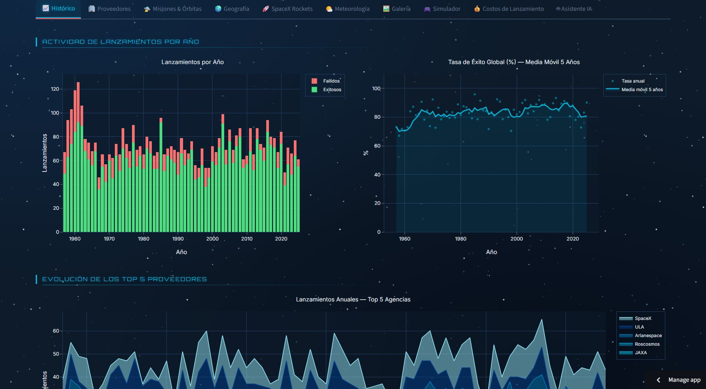
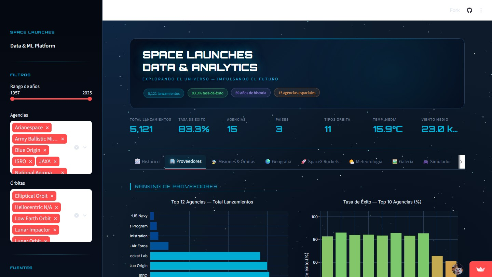
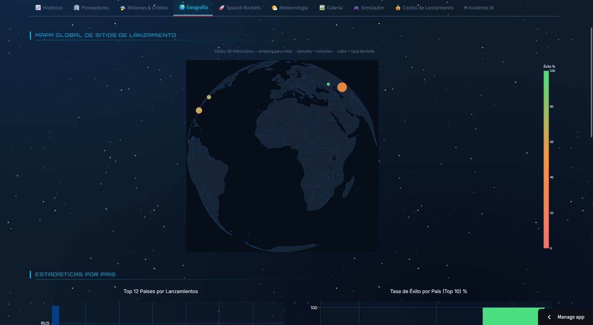
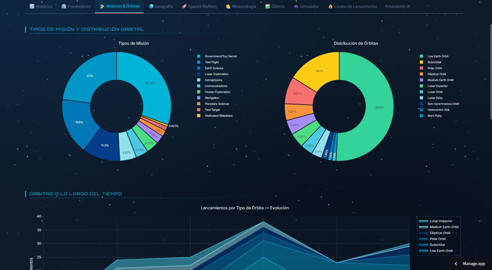
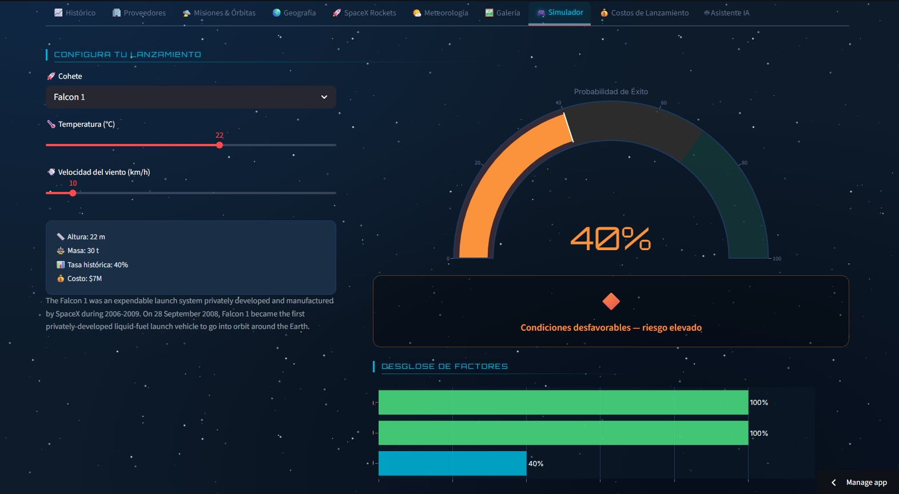
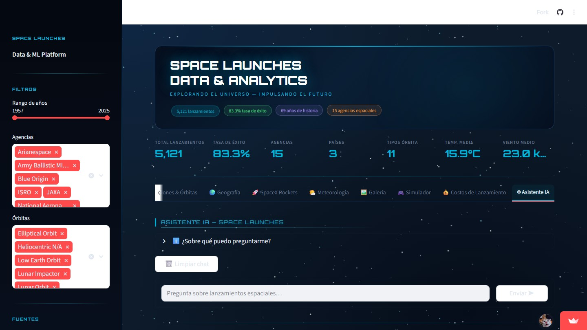
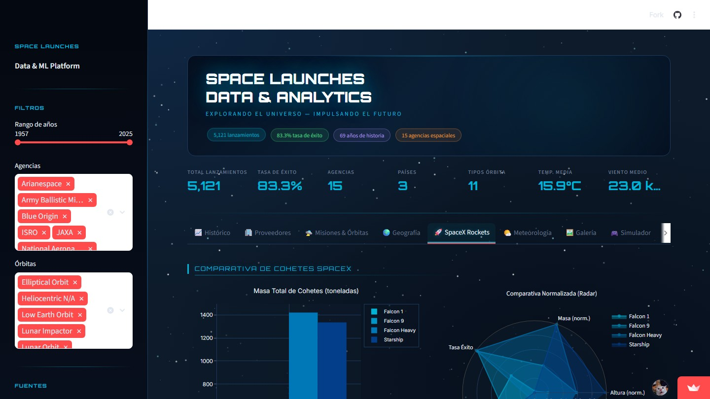
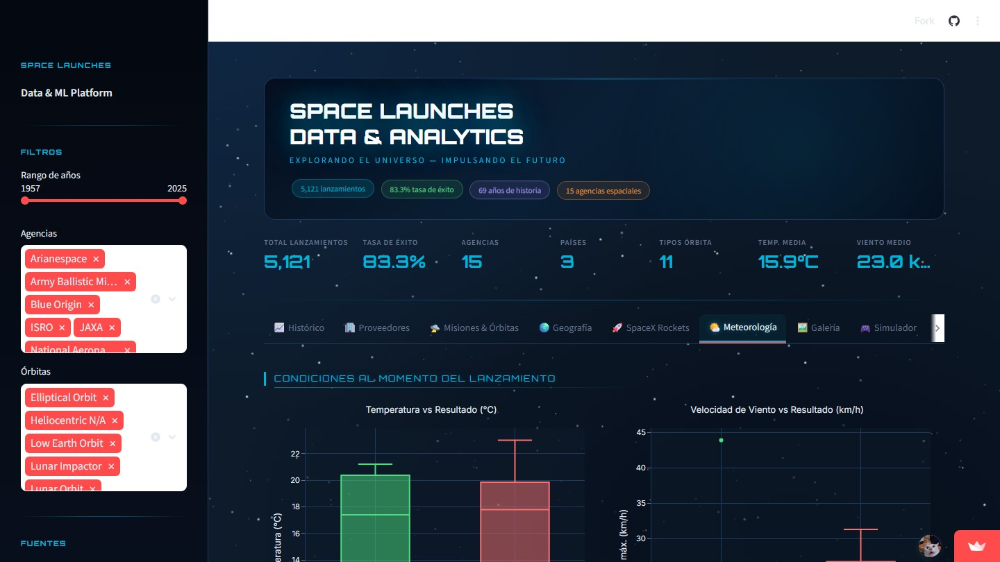
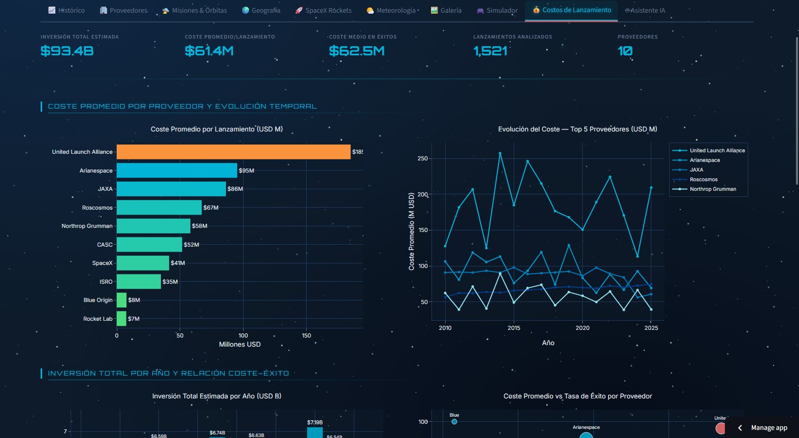

<p align="center">
  
</p>

<p align="center">
  <a href="https://6edvj2y5yvekaoycybfi69.streamlit.app" target="_blank">
    
  </a>
  &nbsp;
  
  &nbsp;
  
  &nbsp;
  
</p>

<p align="center">
  
  &nbsp;
  
  &nbsp;
  
  &nbsp;
  
</p>

<br/>

<p align="center">
  Pipeline <strong>Big Data end-to-end</strong> que ingesta, procesa y visualiza lanzamientos espaciales históricos
  con arquitectura Medallión, dashboard interactivo y asistente de IA en tiempo real.
</p>

---

## ⚡ Inicio rápido — un solo comando

```bash
docker compose up
```

> **Primera ejecución:** ~10 min (ingesta de APIs) · **Siguientes:** segundos (datos en caché)

| Paso | Servicio | Acción |
|:----:|----------|--------|
| 1 | `ingestion` | Extrae datos de 3 APIs → `data/raw/` (JSONL versionado) |
| 2 | `processing` | Transforma con Spark → Silver + Gold (Parquet) |
| 3 | `dashboard` | Dashboard en [localhost:8501](http://localhost:8501) |

```bash
docker compose down   # para todo
```

---

## 🏗️ Arquitectura Medallión

```mermaid
flowchart LR
    subgraph APIs["🌐 Fuentes de Datos"]
        A1["Launch Library 2\n5.000+ lanzamientos"]
        A2["SpaceX API v5\nCohetes & misiones"]
        A3["Open-Meteo\nClima histórico"]
    end

    subgraph RAW["🟠 RAW Layer"]
        R["data/raw/YYYYMMDD_HHMMSS/\n.jsonl · .json"]
    end

    subgraph SILVER["⚪ Silver Layer"]
        S1["launches/"]
        S2["weather/"]
        S3["spacex_rockets/"]
        S4["images/"]
        S5["launch_costs/"]
    end

    subgraph GOLD["🟡 Gold Layer"]
        G1["company_year_metrics/"]
        G2["launch_features/"]
    end

    subgraph DASH["📊 Dashboard"]
        D["Streamlit · 10 tabs\n+ Asistente IA"]
    end

    APIs --> RAW
    RAW -->|"PySpark ETL"| SILVER
    SILVER -->|"Agregaciones"| GOLD
    GOLD --> DASH
```



---

## 📊 Dashboard — 10 Pestañas Interactivas

<p align="center">
  
  &nbsp;
  
</p>
<p align="center">
  <sub>📈 Análisis histórico 2010–2025 &nbsp;&nbsp;&nbsp;&nbsp;&nbsp;&nbsp;&nbsp;&nbsp;&nbsp;&nbsp;&nbsp;&nbsp;&nbsp;&nbsp;&nbsp;&nbsp;&nbsp;&nbsp;&nbsp;&nbsp;&nbsp;&nbsp;&nbsp;&nbsp;&nbsp;&nbsp;&nbsp;&nbsp;&nbsp;&nbsp;&nbsp;&nbsp;&nbsp;&nbsp;&nbsp;&nbsp;&nbsp;&nbsp; 🏢 Ranking de proveedores por tasa de éxito</sub>
</p>

<br/>

<p align="center">
  
  &nbsp;
  
</p>
<p align="center">
  <sub>🌍 Mapa global de sitios de lanzamiento &nbsp;&nbsp;&nbsp;&nbsp;&nbsp;&nbsp;&nbsp;&nbsp;&nbsp;&nbsp;&nbsp;&nbsp;&nbsp;&nbsp;&nbsp;&nbsp;&nbsp;&nbsp;&nbsp;&nbsp;&nbsp;&nbsp;&nbsp;&nbsp;&nbsp;&nbsp;&nbsp;&nbsp;&nbsp;&nbsp;&nbsp; 🛸 Distribución de misiones por órbita</sub>
</p>

<br/>

<p align="center">
  
  &nbsp;
  
</p>
<p align="center">
  <sub>🎮 Simulador de probabilidad de éxito &nbsp;&nbsp;&nbsp;&nbsp;&nbsp;&nbsp;&nbsp;&nbsp;&nbsp;&nbsp;&nbsp;&nbsp;&nbsp;&nbsp;&nbsp;&nbsp;&nbsp;&nbsp;&nbsp;&nbsp;&nbsp;&nbsp;&nbsp;&nbsp;&nbsp;&nbsp;&nbsp;&nbsp;&nbsp;&nbsp;&nbsp;&nbsp;&nbsp;&nbsp;&nbsp; 🤖 Asistente IA con LLaMA 3.3 70B · streaming</sub>
</p>

<details>
<summary><b>Ver todas las pestañas del dashboard</b></summary>

<br/>

| # | Pestaña | Descripción |
|:-:|---------|-------------|
| 1 | 📈 Histórico | Evolución anual, race chart animado de agencias, heatmap estacional |
| 2 | 🏢 Proveedores | Ranking de empresas, tasa de éxito, comparativas entre agencias |
| 3 | 🛸 Misiones | Distribución orbital, galería de imágenes desde la API |
| 4 | 🌍 Geografía | Mapa Scattergeo mundial con color por tasa de éxito |
| 5 | 🚀 Cohetes | Specs técnicas SpaceX, comparativa de vehículos |
| 6 | 🌤️ Meteorología | Correlación temperatura/viento vs resultado de lanzamiento |
| 7 | 🎮 Simulador | Cohete + temperatura + viento → probabilidad de éxito en tiempo real |
| 8 | 💰 Costos | Análisis de costos por proveedor y tipo de misión (1.500+ registros) |
| 9 | 🖼️ Galería | Imágenes de misiones con filtros y paginación |
| 10 | 🤖 Asistente IA | Chat con LLaMA 3.3 70B · contexto del dashboard inyectado · streaming |

<p align="center">
  
  &nbsp;
  
</p>
<p align="center">
  <sub>🚀 Especificaciones técnicas de cohetes SpaceX &nbsp;&nbsp;&nbsp;&nbsp;&nbsp;&nbsp;&nbsp;&nbsp;&nbsp;&nbsp;&nbsp;&nbsp;&nbsp;&nbsp;&nbsp;&nbsp;&nbsp;&nbsp;&nbsp;&nbsp;&nbsp; 🌤️ Correlación climática con resultados</sub>
</p>

<p align="center">
  
</p>
<p align="center">
  <sub>💰 Análisis de costos de lanzamiento por proveedor y categoría</sub>
</p>

</details>

---

## 🤖 Asistente IA

El asistente está impulsado por **LLaMA 3.3 70B** vía [Groq](https://groq.com) con inferencia ultrarrápida y completamente gratuito.

```
Arquitectura: RAG sin vector database
   ┌─────────────────────────────────────┐
   │  Datos Gold (company_year_metrics,  │
   │  launch_features, rockets, costos)  │
   └──────────────┬──────────────────────┘
                  │ context injection
                  ▼
   ┌─────────────────────────────────────┐
   │     System Prompt enriquecido       │
   │  + historial conversación           │
   └──────────────┬──────────────────────┘
                  │ Groq API (SSE streaming)
                  ▼
   ┌─────────────────────────────────────┐
   │       LLaMA 3.3 70B response        │
   │       token a token → UI            │
   └─────────────────────────────────────┘
```

La API key se gestiona con **Streamlit Secrets** — nunca expuesta en código ni en la UI.

---

## 🗂️ Fuentes de datos

<table>
<tr>
<td align="center" width="33%">

**🛰️ Launch Library 2**

`thespacedevs.com`

5.000+ lanzamientos históricos<br/>
Agencia · cohete · pad · coords<br/>
Imágenes de misiones<br/>
✅ Gratuita

</td>
<td align="center" width="33%">

**🚀 SpaceX API v5**

`api.spacexdata.com`

Todos los lanzamientos SpaceX<br/>
Especificaciones técnicas<br/>
Estado de cada misión<br/>
✅ Open Source

</td>
<td align="center" width="33%">

**🌦️ Open-Meteo**

`open-meteo.com`

Historial climático por coords<br/>
Temperatura · viento · presión<br/>
Cruce con fecha de lanzamiento<br/>
✅ Open Source

</td>
</tr>
</table>

---

## ⚙️ Pipeline de datos

### 5.1 Ingesta

```
data/raw/YYYYMMDD_HHMMSS/
├── launch_library_launches.jsonl   # paginado, versionado
├── launch_library_images.jsonl
├── spacex_rockets.json
├── spacex_launches_images.jsonl
├── open_meteo_samples.jsonl
└── manifest.json                   # run_id, timestamp, counts
```

- Cursor persistente para ingesta incremental de Launch Library
- Retry automático y throttling ante errores 429
- `run_id = timestamp` → trazabilidad total por ejecución

### 5.2 Procesamiento Spark (Silver / Gold)

| Capa | Tabla | Descripción |
|------|-------|-------------|
| ⚪ Silver | `launches/` | Lanzamientos normalizados, partición `launch_year` |
| ⚪ Silver | `weather/` | Clima histórico, partición `weather_year` |
| ⚪ Silver | `spacex_rockets/` | Specs técnicas de cohetes SpaceX |
| ⚪ Silver | `images/` | Imágenes de misiones |
| ⚪ Silver | `launch_costs/` | Costes estimados por cohete (lookup join) |
| 🟡 Gold | `company_year_metrics/` | KPIs por agencia y año — tasa de éxito |
| 🟡 Gold | `launch_features/` | Feature table enriquecida — base para ML y simulador |

<details>
<summary><b>Ver transformaciones PySpark</b></summary>

```python
# Join lanzamientos × meteorología (el más interesante)
launches_df.join(
    weather_df,
    on=["pad_lat", "pad_lon", "launch_date"],
    how="left"
).select(
    "launch_id", "provider_name", "rocket_name",
    "mission_orbit", "outcome",
    "temperature_2m_max", "windspeed_10m_max"
).write.partitionBy("launch_year").parquet("data/gold/launch_features")
```

</details>

---

## 💰 Costes de infraestructura

<table>
<tr>
<th>Componente</th>
<th align="center">Actual</th>
<th align="center">Escala (10K usuarios)</th>
</tr>
<tr>
<td>Dashboard (Streamlit Cloud)</td>
<td align="center"><b><span style="color:green">$0</span></b></td>
<td align="center">$50–80/mes</td>
</tr>
<tr>
<td>Asistente IA (Groq)</td>
<td align="center"><b>$0</b></td>
<td align="center">$20–40/mes</td>
</tr>
<tr>
<td>Spark Processing</td>
<td align="center"><b>$0</b> (local)</td>
<td align="center">$80–120/mes</td>
</tr>
<tr>
<td>Datos (3 APIs públicas)</td>
<td align="center"><b>$0</b></td>
<td align="center">$0</td>
</tr>
<tr>
<td>Almacenamiento (Parquet)</td>
<td align="center"><b>$0</b> (local)</td>
<td align="center">$15–30/mes</td>
</tr>
<tr>
<th>TOTAL</th>
<th align="center">🟢 $0/mes</th>
<th align="center">~$270/mes</th>
</tr>
</table>

---

## 🛠️ Stack tecnológico

<table>
<tr>
<th>Capa</th>
<th>Tecnología</th>
<th>Versión</th>
<th>Uso</th>
</tr>
<tr>
<td>Ingesta</td>
<td>Python + httpx</td>
<td>3.11 / 0.25</td>
<td>Fetch de APIs, paginación, retry</td>
</tr>
<tr>
<td>Procesamiento</td>
<td>Apache Spark + PySpark</td>
<td>3.5.1</td>
<td>ETL Silver/Gold, joins, particionado</td>
</tr>
<tr>
<td>Almacenamiento</td>
<td>Apache Parquet</td>
<td>—</td>
<td>Columnar, particionado Hive-style</td>
</tr>
<tr>
<td>Dashboard</td>
<td>Streamlit + Plotly</td>
<td>1.28 / 6.x</td>
<td>10 tabs, mapas, gráficos animados</td>
</tr>
<tr>
<td>Asistente IA</td>
<td>LLaMA 3.3 70B · Groq</td>
<td>—</td>
<td>Chat en streaming, RAG sin vector DB</td>
</tr>
<tr>
<td>Infraestructura</td>
<td>Docker Compose</td>
<td>v2.40</td>
<td>Un comando levanta todo el stack</td>
</tr>
</table>

---

## 📁 Estructura del proyecto

<details>
<summary><b>Ver árbol de directorios</b></summary>

```
proyecto/
│
├── 📥 ingestion/
│   ├── Dockerfile
│   ├── requirements.txt
│   └── src/main.py              # Extracción de 3 APIs con cursor + retry
│
├── ⚡ processing/
│   └── src/silver_gold.py       # Job Spark: RAW → Silver → Gold
│
├── 📊 dashboard/
│   ├── Dockerfile
│   ├── app.py                   # Streamlit app (10 tabs + IA)
│   ├── requirements.txt
│   └── .streamlit/
│       └── secrets.toml         # API keys (gitignored)
│
├── 📂 data/
│   ├── raw/                     # JSONL versionado por timestamp
│   ├── silver/                  # Parquet normalizado (5 tablas)
│   └── gold/                    # Parquet agregado (2 tablas)
│
├── 🎨 presentacion/
│   ├── presentacion_tfg.html        # Reveal.js (16 slides)
│   ├── presentacion_tfg_final.html  # + 6 slides con screenshots reales
│   ├── presentacion_tfg_final.pdf   # PDF exportado (1280×720)
│   ├── presentacion_notas.md        # Notas del orador (22 slides)
│   ├── inject_screenshots.py        # Embebe capturas en el HTML
│   ├── take_screenshots.py          # Playwright → JPEG por tab
│   ├── export_pdf.py                # HTML → PDF sin bordes blancos
│   └── screenshots/                 # 10 JPEGs del dashboard real
│
├── banner.svg                   # Banner animado del README
├── docker-compose.yml           # Orquesta todo con un comando
└── README.md
```

</details>

---

## 🔧 Servicios opcionales

```bash
# Spark UI en localhost:8080
docker compose --profile spark-ui up

# PostgreSQL en localhost:5432
docker compose --profile postgres up
```

## 📥 Ingesta incremental

Cuando Launch Library responde 429, extrae en lotes:

```powershell
# 12 corridas con pausa de 2 minutos entre cada una
.\ingestion\run_incremental_ingestion.ps1 -Runs 12 -PauseSeconds 120
```

Ver [INGESTION-GUIDE.md](INGESTION-GUIDE.md) para más detalles.

---

## 📈 Resultados del proyecto

<p align="center">

| Métrica | Valor |
|:-------:|:-----:|
| 🚀 Lanzamientos analizados | **1.500+** |
| 🌐 APIs integradas | **3** |
| 📊 Pestañas de análisis | **10** |
| 🏢 Agencias cubiertas | **50+** |
| 📅 Años de histórico | **15 (2010–2025)** |
| 🤖 Parámetros del modelo IA | **70 billones** |
| 💶 Coste de infraestructura | **$0/mes** |

</p>

---

## 📄 Licencia

MIT © 2026 Juan Manuel Vega Carrillo

---

<p align="center">
  <b>Juan Manuel Vega Carrillo</b><br/>
  <a href="https://6edvj2y5yvekaoycybfi69.streamlit.app">🚀 Ver demo en vivo</a>
</p>
